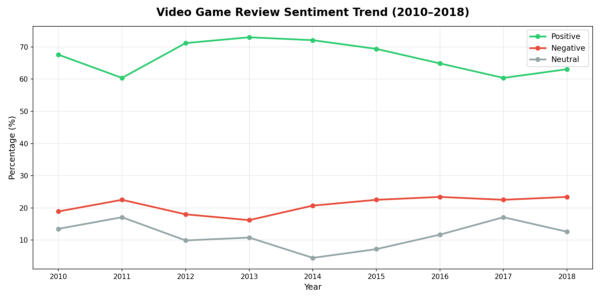
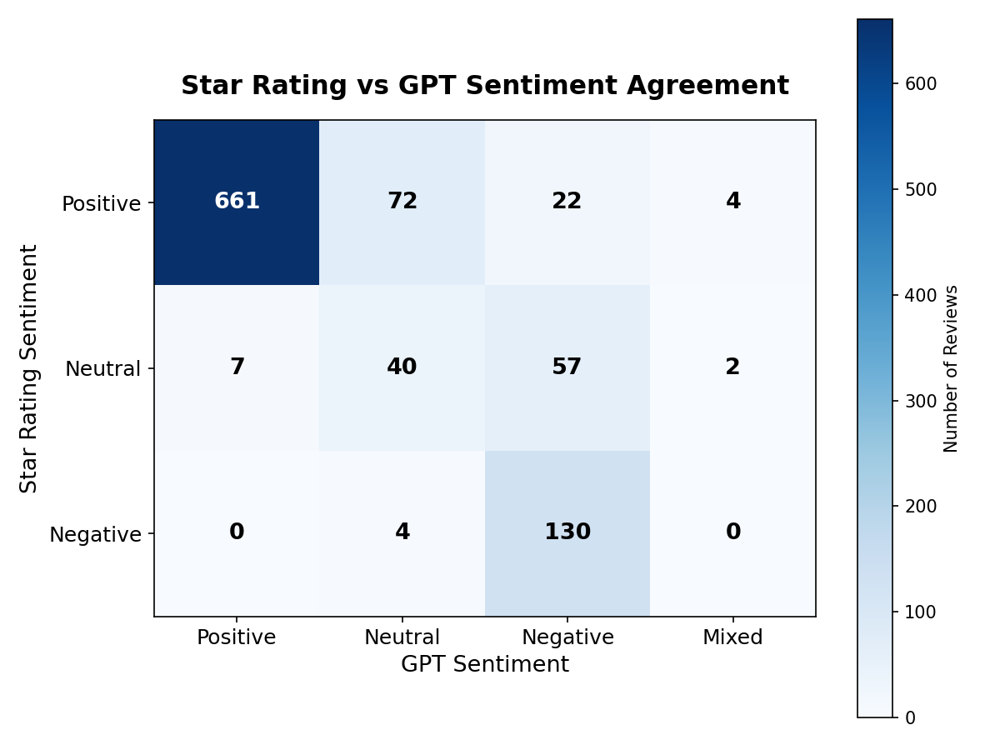

# LLM-Powered Video Game Review Sentiment Analysis

Sentiment analysis of Amazon video game reviews using GPT-4o-mini, validated against reviewer star ratings, with yearly trend analysis, a BigQuery data pipeline, and an interactive Streamlit dashboard.

## Overview

This project classifies the sentiment of Amazon video game reviews (2010–2018) using a large language model, then validates those classifications against the reviewers' own star ratings to find where they agree and disagree. It demonstrates an end-to-end workflow: raw data cleaning, LLM-based classification, validation, cloud data warehousing, and interactive visualization.

## Key Results

- **999 reviews** classified with GPT-4o-mini (111 reviews per year, 2010–2018, to prevent year-to-year bias)
- **Sentiment distribution:** 668 Positive (66.9%), 209 Negative (20.9%), 116 Neutral (11.6%), 6 Mixed (0.6%)
- **83.7% agreement** between GPT sentiment and star-rating-derived sentiment
- **Key finding:** 3-star reviews are frequently classified as Negative by GPT (57 of the disagreement cases), suggesting that mid-range ratings often reflect dissatisfaction rather than true neutrality — a nuance a single star rating cannot capture

## Data Pipeline

The raw dataset was progressively cleaned and filtered before analysis:

| Stage | Reviews |
|-------|---------|
| Raw dataset | 497,577 |
| After removing missing / short reviews | 418,515 |
| After filtering to 2010 onward | 325,528 |
| Stratified sample classified by GPT | 999 |

## Sentiment Trend (2010–2018)



Positive sentiment peaked in 2013 (~73%) and gradually declined toward 2017–2018 (~60%), while negative sentiment stayed relatively stable at 17–23%. Neutral reviews increased slightly toward the end of the period.

## Validation: Star Rating vs GPT Sentiment



Star ratings are mapped to sentiment (4–5 stars = Positive, 3 stars = Neutral, 1–2 stars = Negative) and compared against GPT's classifications. The strong diagonal (661 / 40 / 130) confirms high agreement. The most informative disagreements:

- **Positive stars, Neutral GPT (72 cases):** high-rated reviews often contain hedged language ("good, but...") that GPT reads as less than fully positive.
- **Neutral stars, Negative GPT (57 cases):** 3-star reviews tend to carry more negative language than the rating suggests.

These patterns show that star ratings reflect overall satisfaction, while GPT reads the full review text — including complaints about price, availability, and frustration that the rating alone misses.

## Tech Stack

- **Python** (pandas, matplotlib, numpy)
- **OpenAI GPT-4o-mini** for sentiment classification
- **LangChain** for a reusable prompt -> model -> parser pipeline
- **Google BigQuery** for cloud data warehousing and SQL querying
- **Streamlit** for the interactive dashboard

## Workflow

1. **Data cleaning** – Load the raw Amazon review dataset, drop missing and short (<5 word) reviews, parse dates, and filter to 2010 onward.
2. **Sentiment classification** – Use GPT-4o-mini to classify a stratified sample of 999 reviews (Positive / Negative / Neutral).
3. **Trend analysis** – Compute yearly sentiment percentages and plot the trend over time.
4. **Validation** – Map star ratings to sentiment and measure agreement with GPT via a confusion-matrix heatmap.
5. **LangChain refactor** – Re-implement the classification logic as a reusable LangChain chain.
6. **BigQuery integration** – Upload results to BigQuery and query them back from Python as a pandas DataFrame, completing the end-to-end pipeline (local analysis -> cloud warehouse -> SQL -> back into Python).

## Repository Structure

```
LLM Project.ipynb       # Full analysis notebook (Steps 1-12)
dashboard.py            # Interactive Streamlit dashboard
sentiment_results.csv   # 999 classified reviews (analysis output)
sentiment_trend.png     # Yearly sentiment trend chart
agreement_heatmap.png   # Star rating vs GPT sentiment heatmap
requirements.txt        # Python dependencies
```

## Running Locally

```bash
# Create and activate a virtual environment
python3 -m venv .venv
source .venv/bin/activate

# Install dependencies
pip install -r requirements.txt

# Run the dashboard
streamlit run dashboard.py
```

To re-run the notebook's LLM classification or BigQuery steps, you'll need your own OpenAI API key (in a `.env` file as `OPENAI_API_KEY`) and a Google Cloud service account key. The notebook's API calls are commented out by default so it runs reproducibly from the saved results.

## Data Source

[Amazon Video Games Reviews (Kaggle)](https://www.kaggle.com/datasets/drshoaib/amazon-videogames-reviews). The raw dataset (~497K reviews) is not included in this repository due to size; the cleaned and classified results are provided in `sentiment_results.csv`.

## Notes

- GPT occasionally returned "Mixed" (6 of 999, 0.6%) despite being prompted for three categories, reflecting genuinely ambivalent reviews and the fact that LLMs do not always follow instructions precisely. These cases were excluded from trend analysis.
- Python 3.10 is used here; Google libraries will require 3.11+ after October 2026.
